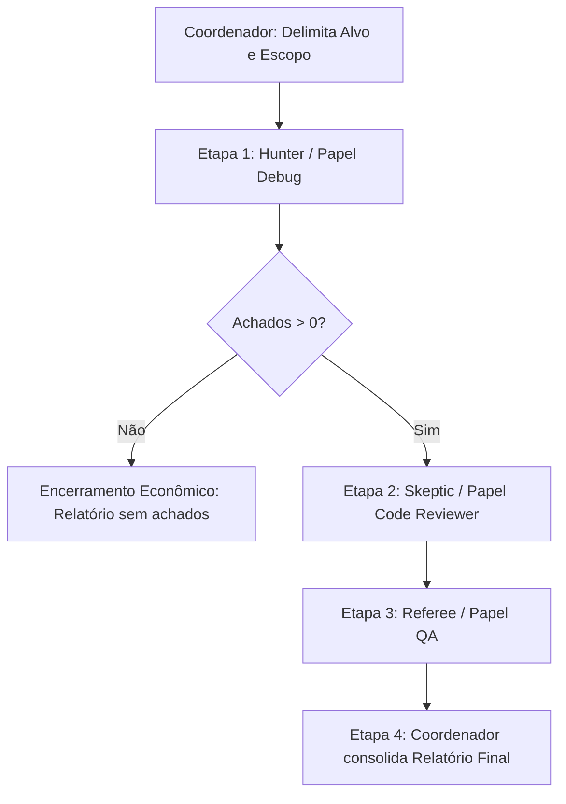

# Modo de Contestação Independente (Bug Hunt Adaptado)

Documento de adaptação para a equipe compartilhada em `/root/agent-team`.
Insumo original: `third_party/bug-hunt/` (commit `5614e19e2bb13fd289105af3b45ced9a3a0f7e99`).

## 1. Objetivo e Princípios

Adicionar à skill `team-investigar-bug` uma capacidade de investigação adversária com contestação independente entre três papéis isolados, preservando a disciplina de escopo, a economia de tokens e os limites operacionais de `/root/agent-team/TEAM_CONTRACT.md`.

Princípios obrigatórios:
1. **Alvo delimitado e teto de esforço**: Nunca executar varredura cega ou ampla do repositório por omissão. O acionamento exige delimitação explícita de repositório, commit/revisão, arquivos/diretórios ou fluxo específico, além de teto máximo de arquivos inspecionados.
2. **Reutilização de papéis existentes**: Não criar três novos agentes permanentes na equipe. O fluxo utiliza execuções separadas e com contexto isolado dos papéis existentes:
   - **Hunter**: Execução isolada do papel `Debug` (`agents/debug.md`).
   - **Skeptic**: Execução isolada do papel `Code Reviewer` (`agents/code-reviewer.md`).
   - **Referee**: Execução isolada do papel `QA` (`agents/qa.md`).
3. **Orquestração pelo agente principal / Coordenador**: Especialistas e subagentes não possuem delegação aninhada nos ambientes reais avaliados (Antigravity e Codex). O Coordenador ou o agente principal deve conduzir a sequência, transferindo apenas os dados estruturados entre etapas.
4. **Poda e economia de contexto**: Se a fase Hunter não encontrar candidatos válidos com evidência (`TOTAL FINDINGS: 0`), encerra-se o fluxo imediatamente, sem acionar Skeptic ou Referee.
5. **Debate finito**: O ciclo possui exatamente uma passagem linear (Hunter → Skeptic → Referee). Não são permitidas rodadas indefinidas de réplica ou tréplica.
6. **Classificação rigorosa**:
   - Pontuações numéricas dos prompts originais são apenas instrumentos mnemônicos e não determinam sozinhas severidade ou confirmação.
   - Cada achado confirmado deve ser categorizado como:
     - `Bug reproduzido`: falha observada com comando/teste e saída reproduzível.
     - `Defeito demonstrado por análise`: inconsistência lógica ou falha estrutural provada na leitura da fonte, sem execução dinâmica.
     - `Hipótese não confirmada`: comportamento suspeito sem prova conclusiva na fonte ou com explicações alternativas válidas.
7. **Ausência de achados**: A ausência de candidatos ou confirmações reporta um ciclo sem achados no escopo delimitado; nunca deve ser tratada como prova absoluta de ausência de bugs no software.
8. **Diagnóstico estrito**: A investigação não autoriza modificação de código ou correções automáticas. Achados sustentados são documentados e encaminhados ao Desenvolvedor se o escopo da tarefa autorizar.

## 2. Critérios de Acionamento

O modo padrão da equipe para investigação de defeitos é o fluxo econômico simples de `team-investigar-bug` (investigação direta por um especialista de `Debug` com `investigate-first`).

O Modo de Contestação Independente só deve ser acionado quando houver uma das seguintes condições:
1. **Falha relevante não resolvida**: A investigação inicial comum não conseguiu determinar a causa ou o mecanismo do defeito em problema crítico.
2. **Achados controversos**: Divergência técnica substantiva entre agentes (ex.: Desenvolvedor e Reviewer) ou entre análise estática e comportamento observado.
3. **Solicitação explícita do usuário**: O usuário requisitou expressamente "caça a bugs aprofundada", "adversarial bug hunt" ou verificação por contestação independente sobre um componente delimitado.

## 3. Fluxo de Orquestração Sequencial

O Coordenador conduz o fluxo em 4 etapas estritas:

### Etapa 1: Coleta de Candidatos (Hunter / Papel Debug)
- **Executor**: Instância isolada de `team-debug`.
- **Entradas**: Caminho/arquivos delimitados, commit e instruções adaptadas (`prompts/hunter.md`).
- **Ação**: Lê os arquivos do escopo com as ferramentas de leitura do ambiente. Identifica anomalias com citação literal de código.
- **Saída**: Tabela estruturada com `BUG-ID`, arquivo, linhas, categoria, alegação concisa e trecho de código evidenciador.
- **Gate de corte**: Se a lista estiver vazia, o Coordenador registra ausência de achados no escopo e encerra o fluxo.

### Etapa 2: Contestação Crítica (Skeptic / Papel Code Reviewer)
- **Executor**: Instância isolada de `team-code-reviewer`.
- **Entradas**: Apenas a lista estruturada de candidatos do Hunter (sem histórico de conversa ou raciocínio intermediário) e instruções adaptadas (`prompts/skeptic.md`).
- **Ação**: Inspeciona diretamente o código fonte de cada item apontado. Avalia se o comportamento é intencional, tratado em outro ponto do fluxo ou um falso positivo.
- **Saída**: Estrutura com `BUG-ID`, contra-argumento técnico citando código, e parecer (`DISPROVE` com evidência ou `ACCEPT`).

### Etapa 3: Arbitragem Independente (Referee / Papel QA)
- **Executor**: Instância isolada de `team-qa` (ou especialista sênior de auditoria técnica).
- **Entradas**: Apenas os dados estruturados do Hunter e os desafios estruturados do Skeptic, acompanhados de `prompts/referee.md`.
- **Ação**: Faz leitura própria e independente do código fonte. Confronta a alegação e a contra-argumentação.
- **Saída**: Veredito por `BUG-ID` (`CONFIRMADO` ou `FALSO POSITIVO / DISPENSADO`), nível de confiança (`Alta`, `Média`, `Baixa`), classificação do achado (`bug reproduzido`, `defeito demonstrado por análise` ou `hipótese não confirmada`), severidade real e sugestão de direcionamento técnico.

### Etapa 4: Consolidação pelo Coordenador
- Apresenta o relatório final estruturado ao usuário ou no registro de tarefa.
- Encaminha itens confirmados ao `Desenvolvedor` somente se autorizado pelo escopo da tarefa.

## 4. Adaptação de Ferramentas por Ambiente

| Ação Conceitual (Bug Hunt original) | Ambiente Antigravity CLI (1.2.4) | Ambiente Codex / Terminal |
| :--- | :--- | :--- |
| Descoberta de arquivos (`Glob`) | `find_by_name` (delimitado ao path) | `find` / `git ls-files` / `ls` |
| Busca por padrões (`Grep`) | `grep_search` (com SearchPath estrito) | `rg` / `grep -rn` |
| Leitura de código (`Read`) | `view_file` (com StartLine/EndLine) | Ferramenta de leitura de arquivo |
| Diferença de branch (`Bash git diff`) | `run_command` com `git diff --name-only` | `git diff --name-only` via shell |
| Invocação de agente isolado (`Agent`) | `invoke_subagent` com `TypeName` e `Prompt` | Delegação explícita via coordenador |

Não declarar compatibilidade nativa de carregamento automático sem verificação operacional. A passagem de parâmetros e prompts deve ser explícita na delegação.
